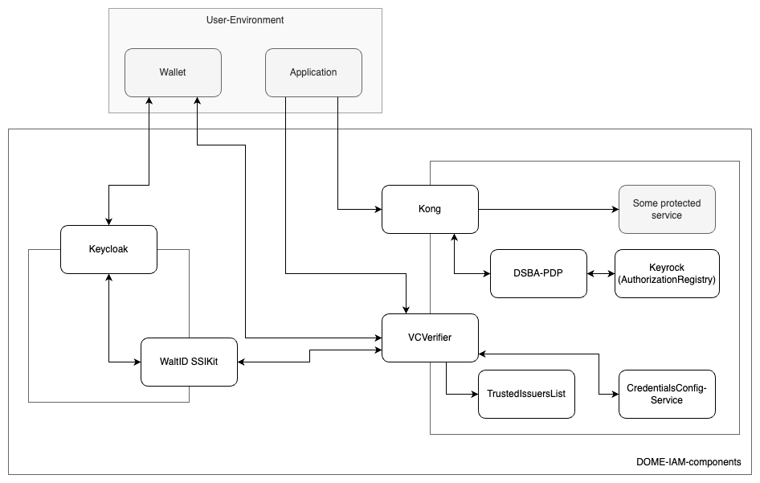

# The DOME IAM-components

[](https://opensource.org/licenses/Apache-2.0)
[](https://github.com/DOME-Marketplace/iam-components/actions/workflows/test.yaml)

The DOME IAM-Framework is a set of microservices, that enables users in the DOME ecosystem to authenticate into
the [DOME Marketplace](https://dome-marketplace.org).

> :bulb: For detailed information on how to integrate with the DOME Marketplace, check the [Integration Guide](https://github.com/DOME-Marketplace/integration-guide)

## Components

The DOME IAM-Framework consists of multiple open-source components. The components are not required to be used, as long
as alternatives providing the same interfaces are used.

The IAM-Framework consists of following components: 



### [Trusted Issuers List](https://github.com/fiware/trusted-issuers-list)

The Trusted-Issuers-List service provides an [EBSI Trusted Issuers Registry](https://hub.ebsi.eu/apis/pilot/trusted-issuers-registry/v4) implementation to act as
the Trusted-List-Service in the DSBA Trust and IAM Framework. In addition, a Trusted-Issuers-List API is provided to
manage the issuers.

### [VCVerifier](https://github.com/fiware/vcverifier)

VCVerifier provides the necessary endpoints to offer SIOP-2/OIDC4VP compliant authentication flows. It exchanges
VerifiableCredentials for JWT, that can be used for authorization and authentication in down-stream components.

### [Credentials Config Service](https://github.com/fiware/credentials-config-service)

Credentials Config Service manages and provides information about services and the credentials they are using. It
returns the scope to be requested from the wallet per service and the credentials and issuers that are considered to be
trusted for a certain service.

### [Keycloak-VC-Issuer](https://github.com/fiware/keycloak-vc-issuer)

The Keycloak-VC-Issuer is plugin for Keycloak to support SIOP-2/OIDC4VP clients and issue VerifiableCredentials through
the OIDC4VCI-Protocol to compliant wallets.

### [PDP](https://github.com/fiware/dsba-pdp)

Implementation of a Policy-Decision Point, evaluating Json-Web-Tokens containing VerifiableCredentials in a
DSBA-compliant way. It also supports the evaluation in the context of i4Trust.

### [Keyrock](https://github.com/ging/fiware-idm)

Keyrock is the FIWARE component responsible for Identity Management. Using Keyrock (in conjunction with other security
components) enables you to add OAuth2-based authentication and authorization security to your services and applications.

### [Kong Plugins](https://github.com/fiware/kong-plugins-fiware)

These allow to extend the API Gateway Kong by further functionalities required for FIWARE-based environments. Kong
Gateway is a lightweight, fast, and flexible cloud-native API gateway. An API gateway is a reverse proxy that lets you
manage, configure, and route requests to your APIs.

## Deployment

It's recommended to install the IAM-components on [Kubernetes(> 1.26.7)](https://kubernetes.io/), using [Helm](https://helm.sh/).
For alternative installations, see the individual components' documentation.

> :bulb: An example of a federated marketplace, deployed on top of a[managed Kubernetes by IONOS](https://dcd.ionos.com/)
> can be found in [DOME-Gitops](https://github.com/DOME-Marketplace/dome-gitops)

### Install

The IAM-components are provided as an [Umbrella Chart](https://helm.sh/docs/howto/charts_tips_and_tricks/#complex-charts-with-many-dependencies),
containing dependencies to all mentioned [components](#components), allowing to install them all at once:

```shell
helm repo add dome-iam https://dome-marketplace.github.io/iam-components
helm install <RELEASE_NAME> dome-iam/iam-components
```
> :bulb: All releases of the IAM-components reside in the helm-repository https://dome-marketplace.github.io/iam-components.
> In addition to that, all Pre-Release versions (build from the Pull Requests) are provided in the pre-repo https://dome-marketplace.github.io/iam-components/pre.
> The pre-repo will be cleaned-up from time to time, in order to keep the index manageable.

It provides a sane set of default-values. To actually use the IAM-components the following values have to be replaced:

* `rbac` and `serviceAccount`: Depending on your requirements, you might need to adapt settings for RBAC and service
account
* `ingress` or `route`: You need to set up these settings to make a component externally accessible
* `did`s of participants: Replace/add the DIDs of the issuer and other participants
* `keycloak.frontendUrl`: Externally accessible address of the keycloak (should be the same as defined in ingress/route)
* `keycloak.realm`: Adapt clients, users and roles according to your needs
* `trusted-issuers-registry.tir.satellite`: replace/add these settings for the satellite
* `keyrock.initData.scriptData`: Adapt the roles as in keycloak realm
* `kong.configMap`: Adapt the kong services and their routes

## Test

The Helm-Chart is integration-tested with a local [k3s-instance](https://k3s.io/).

The test uses the following tools:

* templated by [Helm](https://helm.sh), using the [Helm Maven-Plugin](https://github.com/kokuwaio/helm-maven-plugin)
* deployed with the [k3s Maven-Plugin](https://github.com/kokuwaio/k3s-maven-plugin)
* tested with [Cucumber](https://cucumber.io/)

The test-setup looks as following:


### Run the tests

To execute all tests, run:

```shell
mvn clean integration-test
```

### Extend the tests

The definition of features is available under the [test-resources](./it/src/test/resources/it). Steps can be added to
the [StepDefinitions](./it/src/test/java/org/dome/iam/it/StepDefinitions.java) or through a new class.

## CI

The IAM-components repository uses a CI-Pipeline to deliver the Helm-Chart as a tested and versioned component.

The CI is set up as following:
* integration-tests are executed on every push
* on every PR to ```main```, the CI checks if anything inside the ```/charts/iam-components``` folder was changed
  * if false: skip release and allow merging to main
  * if true:
    * generate the new version, based on the tag assigned to the PR (patch,minor,major)
    * set the version to the Chart.yaml, postfixed with ```-PRE-<PR_NUMBER>``` following the [SemVer 2.0 Spec](https://semver.org/)
    * generate the updated documentation
    * add the chart to the pre-repo(https://dome-marketplace.github.io/iam-components/pre)
* on push-to-main (e.g. merged PR), the CI checks if anything inside the ```/charts/iam-components``` folder was changed
  * if false: skip release and allow merging to main
  * if true:
    * generate the new version, based on the tag assigned to the PR (patch,minor,major)
    * set the version to the Chart.yaml
    * generate the updated documentation
    * add the chart to the helm-repo(https://dome-marketplace.github.io/iam-components)
    * create a tag and a GitHub release